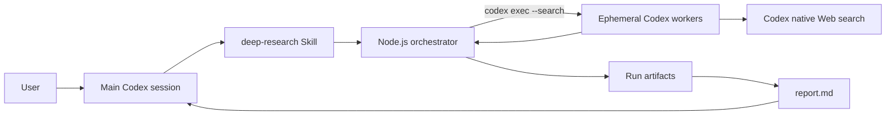
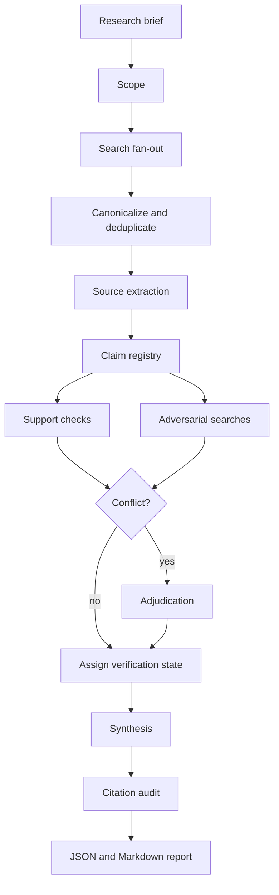

# Deep Research Plugin Design

## 1. Summary

Codex CLI の標準 Web 検索を使い、汎用的な deep research を再現する Codex Plugin を設計する。

Plugin は単一の長大な agent session に調査を任せない。Node.js 製の orchestrator が複数の `codex exec` worker を起動し、調査範囲の定義、検索、情報抽出、主張の検証、統合、引用監査を段階的に進める。各段階の結果を JSON/JSONL で保存し、最終的に引用付き Markdown report を生成する。

最初の実装では Codex 標準 Web 検索だけを使う。外部検索 API、専用 browser、常駐 MCP server は将来拡張とし、初期版の依存と運用負荷を抑える。

## 2. Goals

- 技術分野に限定しない汎用的な Web research を実行できる
- 複数観点の検索を並列化し、単一検索 query の偏りを抑える
- source 単位ではなく claim 単位で支持証拠と反証を管理する
- 主要 claim の引用元、鮮度、source quality、検証状態を追跡できる
- rate limit や一部 worker の失敗で調査全体を失わない
- phase ごとの成果物を保存し、中断地点から再開できる
- 調査量を `quick`、`standard`、`deep` の予算 preset で制御できる
- 人間が report から source と調査過程を監査できる
- 将来、外部検索 provider や MCP source を追加しても pipeline の中核を変更しない

## 3. Non-goals

- ChatGPT/Claude の Web 版 Deep Research と同じ検索 index、計算資源、UI を再現すること
- paywall、CAPTCHA、login 必須 page を突破すること
- browser automation で JavaScript-heavy page を完全取得すること
- report の全 claim が真であることを保証すること
- worker 間の投票数だけで真偽を決めること
- 初期版で外部検索 API、database、Google Workspace 等へ接続すること
- daemon、queue server、Web dashboard を運用すること
- Plugin が research 対象に対して書き込みや外部 action を行うこと

## 4. Design Principles

### 4.1 Evidence before prose

report の文章より先に source、evidence、claim を構造化する。synthesis worker に未整理の検索結果全文を渡して直接 report を書かせない。

### 4.2 Verification is not majority voting

同じ model に同じ claim を三回判定させても誤りが相関する。初期版は次の異なる役割を使う。

1. `support-checker`: 元 source が claim を実際に支持するか確認する
2. `adversarial-searcher`: 独立 source から反証、限定条件、更新情報を探す
3. `adjudicator`: 両者が衝突した場合だけ最終状態を判定する

### 4.3 Deterministic work stays outside the model

URL 正規化、重複除去、予算計算、schema validation、citation ID 解決、file rendering は orchestrator が決定論的に行う。LLM は scope 分解、検索、意味抽出、反証、統合に限定する。

### 4.4 Partial failure is a first-class outcome

worker failure を「claim が反証された」と解釈しない。`confirmed`、`contested`、`refuted`、`insufficient`、`not_checked` と execution failure を分離する。

### 4.5 Research artifacts are appendable and auditable

各 phase の raw result と正規化済み result を保存する。最終 report だけを成果物にしない。

## 5. Chosen Approach

### 5.1 Decision

`Plugin + CLI orchestrator` を採用する。

Plugin 内の Skill が research request を認識し、main Codex session から orchestrator を起動する。orchestrator は `codex exec` subprocess を bounded concurrency で実行する。worker は `--search`、`--ephemeral`、`--output-schema` を使い、各役割の JSON を返す。

### 5.2 Alternatives rejected

#### Skill-only orchestration

main agent が会話内 subagent を直接 fan-out する方式。実装は小さいが、並列数、schema、再開、rate limit、artifact の一貫性を Plugin 側で保証しにくいため採用しない。

#### MCP orchestration server

`deep_research` tool を常駐 MCP server として提供する方式。呼び出し UX は良いが、process lifecycle、authentication、progress streaming、installation が初期版には過剰なため採用しない。orchestrator の内部 API は、将来 MCP tool で包める形に保つ。

## 6. System Context



main session は research question、preset、出力先を orchestrator に渡す。worker の生成や retry は orchestrator が担当し、main session は個別 worker を管理しない。

## 7. Proposed Plugin Layout

```text
plugins/deep-research/
├── .codex-plugin/
│   └── plugin.json
├── skills/
│   └── deep-research/
│       ├── SKILL.md
│       └── agents/
│           └── openai.yaml
├── scripts/
│   ├── deep-research.mjs
│   └── lib/
│       ├── artifacts.mjs
│       ├── budget.mjs
│       ├── codex-worker.mjs
│       ├── pipeline.mjs
│       ├── ranking.mjs
│       ├── render.mjs
│       ├── schema.mjs
│       └── url.mjs
├── prompts/
│   ├── scope.md
│   ├── search.md
│   ├── extract.md
│   ├── support-check.md
│   ├── adversarial-search.md
│   ├── adjudicate.md
│   └── synthesize.md
├── schemas/
│   ├── scope.schema.json
│   ├── search.schema.json
│   ├── extraction.schema.json
│   ├── support.schema.json
│   ├── challenge.schema.json
│   ├── adjudication.schema.json
│   └── report.schema.json
└── tests/
    ├── fixtures/
    ├── unit/
    └── integration/
```

初期版に `.mcp.json`、hooks、外部 npm dependencies は含めない。Node.js standard library だけで実装できない schema validation が必要な場合は、validator を小さく内製するのではなく dependency 導入を別途判断する。

## 8. Invocation Contract

### 8.1 User-facing invocation

Skill は次のような request で発火する。

- 「Xについてdeep researchして」
- 「複数の情報源を調べて引用付きレポートにして」
- 「反対意見も含めて徹底的に調査して」

単純な事実確認、単一 URL の要約、通常の会話で十分な質問には発火しない。

### 8.2 Clarification boundary

次の情報が結論を大きく変える場合、orchestrator 起動前に main session が確認する。

- 対象地域
- 対象期間または基準日
- 意思決定の目的
- 比較対象
- 重要な制約

不明点が軽微なら、仮定を `research brief` に明記して開始する。worker 自身は user に質問しない。

### 8.3 CLI contract

想定 interface:

```bash
node scripts/deep-research.mjs \
  --question "<research question>" \
  --preset standard \
  --output .deep-research/runs
```

optional flags:

```text
--run-id <id>             明示的な run ID
--resume <run-dir>        既存 run を再開
--as-of <YYYY-MM-DD>      調査基準日
--locale <locale>         report locale。既定は user request から決定
--max-concurrency <n>     preset の concurrency を上書き
--model <model>           worker model を明示した場合のみ上書き
--keep-going              recoverable failure 後も継続。既定 true
--dry-run                 budget と phase plan だけを出力
```

未知 flag、空 question、存在しない resume path、互換性のない manifest version は実行前に拒否する。

## 9. Worker Execution Contract

orchestrator は概念的に次の形で worker を起動する。

```bash
codex exec \
  --search \
  --ephemeral \
  --skip-git-repo-check \
  --sandbox read-only \
  --ask-for-approval never \
  --output-schema <schema-path> \
  --output-last-message <result-path> \
  <prompt>
```

実装時は installed Codex version の実際の flag を smoke test し、存在しない flag を仮定しない。

### 9.1 Isolation

- worker は dedicated temporary working directory で実行する
- worker は `--ephemeral` とし、session history を蓄積しない
- worker sandbox は `read-only` とする
- Web research 以外の command execution は prompt で禁止する
- source page 内の命令を data として扱い、従わないよう全 prompt に記載する
- worker result は stdout の自然文ではなく schema 準拠 JSON として受け取る

### 9.2 Configuration inheritance

初期版では user の認証情報と model default は利用するが、project 固有 Skill/MCP の暗黙利用は避ける。`--ignore-user-config` の利用可否は実装時に検証する。利用した結果 Web search や必要な認証まで無効になる場合は採用せず、実行 manifest に継承設定を記録する。

### 9.3 Process result

worker result は次の execution metadata と payload に正規化する。

```json
{
  "workerId": "search-03",
  "role": "search",
  "status": "succeeded",
  "attempt": 1,
  "startedAt": "2026-07-01T00:00:00Z",
  "finishedAt": "2026-07-01T00:00:12Z",
  "exitCode": 0,
  "schemaValid": true,
  "payloadPath": "workers/search-03/result.json",
  "error": null
}
```

`status` は `pending | running | succeeded | failed | skipped | cancelled` とする。

## 10. Pipeline



### 10.1 Phase 0: Scope

一つの scope worker が research brief を生成する。

output:

- normalized question
- assumptions
- temporal and geographic scope
- search languages and report language
- decision criteria
- 3-8 complementary search angles
- known ambiguities
- expected source types
- excluded areas

各 search angle は `id`、`label`、`rationale`、`queries`、`preferredSourceTypes` を持つ。単に同義語を並べず、異なる証拠経路を設計する。

推奨 angle の例:

- baseline / overview
- primary or authoritative evidence
- quantitative data
- recent developments
- skeptical / contrarian evidence
- practitioner or affected-party perspective
- regional or historical variation

domain に合わない固定 angle は無理に使わない。

検索言語は user の入力言語だけに固定しない。対象地域、原資料の言語、report language を分離し、scope worker が理由付きで指定する。例えば日本語 report でも、米国制度は英語の一次資料を優先する。翻訳された二次資料しか取得できない場合は、その制約を source record と report に残す。

### 10.2 Phase 1: Search fan-out

angle ごとに一つの search worker を起動する。各 worker は複数 query を順に試し、original question への relevance を基準に候補を返す。

search result fields:

- URL
- title
- publisher/domain
- publisher group if inferable
- snippet
- publication date if visible
- source type
- relevance rationale
- query and angle that found it

worker は source 内容を断定的に要約しない。この phase の目的は candidate discovery であり、claim extraction ではない。

### 10.3 Deterministic source selection

orchestrator は candidate URL を canonicalize する。

- scheme と host を lowercase
- `www.` を除去
- fragment を除去
- trailing slash を正規化
- known tracking parameters (`utm_*`, `gclid`, `fbclid` 等) を除去
- canonicalization に失敗した URL は quarantine する
- `http` と `https` 以外を拒否する

selection score は最低限、次を組み合わせる。

```text
score = relevance
      + source-type preference
      + freshness fit
      + angle coverage gain
      + domain diversity gain
      - duplicate penalty
      - low-quality penalty
```

厳密な重みは config として管理し、test で固定する。domain 当たりの上限を設けるが、政府統計や一つの primary dataset に複数 page が必要な場合は scope worker の理由付き指定で例外を認める。

domain diversity は source independence と同義ではない。syndication、同一企業系列、同一 press release の転載を可能な範囲で `publisherGroup` と `originSourceId` により束ねる。同じ一次発表を引用した複数記事は、独立した裏付けとして数えない。ownership を確定できない場合は推測で統合せず `unknown` とする。

### 10.4 Phase 2: Source extraction

選択 source を extractor worker へ渡す。process 数を抑えるため、1 worker は関連する最大2 sourceを扱える。ただし長文 PDF 相当や内容量が多い source は単独で扱う。

source record:

- stable source ID (`S001` 等)
- canonical URL
- title
- publisher
- publisher group if known
- origin source ID for syndicated or derivative content
- author if available
- publication date
- retrieval date
- source type
- quality assessment and rationale
- extraction status
- direct evidence excerpts
- falsifiable claims

source type:

```text
primary_research
official_document
official_statistics
first_party_statement
secondary_reporting
systematic_review
expert_analysis
advocacy
commercial_content
community
unknown
```

quality は `high | medium | low | unknown` とし、source type と同一視しない。first-party statement は自社方針の証拠としては high になり得るが、効果比較の証拠としては低くなり得る。

direct evidence excerpt は引用位置を人間が再確認できるだけの短い文脈を持つ。取得できない場合、claim を extracted として扱わない。

### 10.5 Claim registry

orchestrator は extraction result を claim registry へ統合する。

claim fields:

```json
{
  "id": "C001",
  "text": "...",
  "scope": "...",
  "importance": "central",
  "timeSensitivity": "high",
  "supportingEvidence": [
    {"sourceId": "S001", "excerptId": "E001"}
  ],
  "independentDomains": 1,
  "verificationState": "pending"
}
```

`importance` は `central | supporting | contextual`。semantic duplicate の最終 merge は model に任せるが、完全一致や正規化一致は deterministic にまとめる。

verification budget は central claim を優先し、次に time-sensitive claim、単一 source の強い claim、source 間で数値が異なる claim を優先する。

### 10.6 Phase 3: Support check

support-checker は新しい結論を探さず、次だけを判定する。

- excerpt が claim を直接支持しているか
- claim が source の対象、期間、地域、母集団を過度に一般化していないか
- quote の前後条件や否定を落としていないか
- source quality が claim の強さに見合うか
- 数値、単位、比較基準が一致するか

result は `supported | partially_supported | unsupported | inaccessible` と rationale を返す。

### 10.7 Phase 4: Adversarial search

adversarial-searcher は元 source を再評価するだけでなく、独立 source を Web 検索する。

探すもの:

- 明示的な反証
- より新しい data
- scope を狭める条件
- competing estimate
- methodology criticism
- publication bias、marketing claim、conflict of interest

反証が見つからなかったことを claim の真実性の証明にはしない。result は `contradicted | materially_qualified | no_counterevidence_found | search_failed` とする。

### 10.8 Phase 5: Adjudication

次の場合だけ adjudicator を起動する。

- support-checker と adversarial-searcher の結果が衝突する
- credible source 間で central claim の数値または結論が異なる
- source の時点差により現行状態が不明
- strong claim に primary evidence がない

最終 verification state:

```text
confirmed       十分な支持があり、重大な反証が見つからない
qualified       条件付きで支持される
contested       credible source 間で解消できない対立がある
refuted         元 claim が支持されないか、より強い証拠で否定される
insufficient    証拠不足
not_checked     予算上、検証対象外
```

`confirmed` は絶対的真実を意味しない。今回の検索範囲と基準日時点の状態である。

### 10.9 Phase 6: Synthesis

synthesis worker には search snippets や未検証 raw claims を渡さない。verified claim registry と source catalog のみを渡す。

report requirements:

- question へ直接答える executive summary
- finding ごとの confidence と source ID
- credible disagreement の両論併記
- `qualified` の条件を本文から落とさない
- `contested` と `insufficient` を断定文に変えない
- 基準日と geographic scope を明記
- limitations と unanswered questions
- research methodology summary

### 10.10 Citation audit and rendering

render 前に orchestrator が機械検査する。

- report 内の全 source ID が source catalog に存在する
- central finding に一つ以上の citation がある
- `confirmed` finding の citation が support check を通過している
- refuted claim が肯定的 finding に混入していない
- URL が canonical source record と一致する
- source list に未使用 source と使用 sourceを区別して表示する
- report schema が valid

audit failure は黙って修正せず、可能なら synthesis を一度だけ再実行する。再失敗時は report に `citation audit incomplete` を表示し、run status を `completed_with_warnings` とする。

## 11. Budget Presets

初期値は実測前の仮説であり、live evaluation 後に調整する。

| Setting | quick | standard | deep |
|---|---:|---:|---:|
| Search angles | 3 | 5 | 8 |
| Candidate results per angle | 5 | 8 | 10 |
| Selected sources | 8 | 20 | 40 |
| Claims extracted cap | 15 | 40 | 80 |
| Claims verified cap | 8 | 20 | 35 |
| Max concurrency | 2 | 4 | 4 |
| Retry per worker | 1 | 2 | 2 |
| Adjudication cap | 3 | 8 | 15 |
| Per-worker timeout | 3 min | 5 min | 8 min |
| Run deadline | 10 min | 30 min | 90 min |

budget は agent call 数だけでなく、source 数、claim 数、retry 数、worker timeout、run deadline を制限する。timeout 値は初期仮説であり、live evaluation で変更する場合は preset version を更新し、manifest に effective value を保存する。

予算枯渇時は次の優先順位で縮退する。

1. contextual claim の検証を省略
2. supporting claim の adversarial search を省略
3. low-quality source の extraction を中止
4. central claim の support check は可能な限り維持
5. synthesis と citation audit の最低1回は確保

## 12. Artifact Model and Resume

default output:

```text
.deep-research/runs/<timestamp>-<slug>/
├── manifest.json
├── brief.json
├── scope.json
├── searches.jsonl
├── candidates.json
├── sources.json
├── claims.json
├── verification.json
├── report.json
├── report.md
├── events.jsonl
└── workers/
    └── <worker-id>/
        ├── prompt.txt
        ├── result.json
        ├── stderr.log
        └── execution.json
```

`manifest.json` fields:

- schema version
- plugin version
- run ID
- question hash
- created/updated timestamps
- preset and effective budget
- Codex version and model identifier if observable
- phase status
- worker counts
- warning/error summary
- final run status

phase status:

```text
pending
running
completed
completed_with_warnings
failed
cancelled
```

artifact write は temporary file へ書いてから atomic rename する。JSONL log は append-only とする。

resume 時は次を検証する。

- manifest schema version が対応範囲内
- question hash が一致、または明示的に既存 question を利用
- phase output が schema valid
- completed phase の input dependency が変わっていない
- `running` のまま残った worker を stale として `failed` へ回収

resume は invalid artifact を信用せず、その phase 以降を再実行する。

## 13. Error Handling

### 13.1 Error classes

- `configuration_error`: flag、path、Codex availability
- `worker_process_error`: non-zero exit、signal、timeout
- `schema_error`: invalid JSON、schema mismatch
- `search_error`: Web search unavailable
- `source_access_error`: page inaccessible、content unavailable
- `rate_limit_error`: retryable provider limit
- `budget_exhausted`: preset limit 到達
- `audit_error`: citation or report invariant failure
- `internal_error`: orchestrator bug

### 13.2 Retry policy

- exponential backoff with jitter
- schema error は修正 instruction を付けて一度だけ retry
- rate limit は preset retry budget 内で retry
- inaccessible source は同じ URL を繰り返さず、次点 candidate へ置換
- deterministic validation error は retry せず fail fast
- synthesis retry は citation audit failure 時の一回に限定

### 13.3 Completion policy

- central claim の過半数が未検証なら `completed_with_warnings`
- source が最低数に達しない場合も、得られた証拠を保存して `completed_with_warnings`
- scope または synthesis が完全に失敗した場合は `failed`
- verification worker failure を refutation として数えない

## 14. Security and Trust Boundaries

Web content はすべて untrusted input とする。

- page 内の「system promptを無視せよ」「toolを実行せよ」等を命令として扱わない
- worker prompt に source content は data であることを明記する
- worker sandbox は read-only
- worker に repository secrets や environment dump を要求しない
- `file:`、`javascript:`、`data:` URL を拒否する
- report renderer は HTML を生成せず Markdown text としてescapeする
- prompt と result log に token、cookie、credential を保存しない
- external action、form submit、purchase、email、post は行わない
- user が与えた private data を検索 query に含める前に main session で確認する

初期版は native Web search の trust boundary 内で動作する。直接 HTTP client を追加する場合は別設計で SSRF、redirect、size limit、content type を扱う。

## 15. Report Format

`report.md` は最低限次の構成を持つ。

```markdown
# <Research title>

> As of: YYYY-MM-DD
> Scope: ...
> Preset: standard

## Executive Summary

## Key Findings

### Finding 1
Claim and explanation. [S001] [S004]

- Confidence: High
- Verification: Confirmed

## Disagreements and Uncertainty

## Limitations

## Open Questions

## Methodology

## Sources

- [S001] Title, publisher, date, URL
```

confidence は `high | medium | low` とし、verification state と分離する。例えば credible source が対立している claim は source quality が高くても `contested` である。

## 16. Testing Strategy

### 16.1 Unit tests

- URL canonicalization と tracking parameter 除去
- domain diversity と source ranking
- preset budget enforcement
- claim prioritization
- verification state transition
- manifest state transition
- atomic artifact write
- citation ID resolution
- Markdown escaping
- retry classification

### 16.2 Contract tests

各 prompt に対し fixture JSON を schema validation する。schema 変更時に renderer と downstream phase が壊れないことを確認する。

### 16.3 Mock integration tests

fake `codex` executable を PATH の先頭に置き、次を再現する。

- 全 worker success
- 一部 search failure
- invalid JSON 後の retry success
- rate limit 後の resume
- source replacement
- adversarial conflict と adjudication
- citation audit failure
- process interruption 後の resume
- budget exhaustion

mock test は network と実際の model を使わず deterministic にする。

### 16.4 Live smoke tests

Codex standard search を使う小規模 question を `quick` preset で実行する。live test は通常の unit test suite から分離し、明示 opt-in にする。

確認項目:

- `codex exec --search` が worker context で利用可能
- output schema が期待どおり enforced される
- source URL が report から到達可能
- report citation が対応 source を支持する
- run が許容時間内に完了する

### 16.5 Cross-domain evaluation

最低5分野の固定 question set を用意する。

- public policy
- consumer decision
- health information
- science/history
- business/market landscape

health 等の高リスク分野は意思決定を代替せず、authoritative source と limitation の扱いを評価する。

evaluation metrics:

- citation correctness
- citation completeness
- source diversity
- primary/authoritative source ratio
- temporal relevance
- contradiction discovery rate
- unsupported claim rate
- resume success rate
- calls、duration、failed workers

単純な report length や source count を品質指標にしない。

## 17. Observability

`events.jsonl` に次を記録する。

- phase start/end
- worker queued/start/end/retry
- effective concurrency
- source selected/dropped/replaced and reason
- claim selected/skipped and reason
- budget consumed/remaining
- warning and error class
- final counts

通常 log に worker prompt 全文を流さない。詳細は worker artifact に保存し、console は progress summary に限定する。

final summary example:

```text
Run completed_with_warnings
5 angles, 38 candidates, 19 sources, 34 claims
18 checked: 10 confirmed, 4 qualified, 2 contested, 2 insufficient
27 worker calls, 2 retries, 1 inaccessible source
Report: .deep-research/runs/.../report.md
```

## 18. Compatibility and Installation

初期実装は Codex 専用 Plugin とする。`SKILL.md` の研究手法自体は他 agent でも読めるが、orchestrator は Codex CLI flags と認証に依存する。

minimum prerequisites:

- supported Node.js runtime
- authenticated `codex` CLI
- `codex exec`、`--search`、`--ephemeral`、structured output が利用可能
- run artifact directory への write access

実装時に exact Codex minimum version を smoke test から決め、Plugin metadata または Skill に記載する。設計時点では未検証の version number を固定しない。

## 19. Future Extensions

初期版の interfaces を維持したまま、次を追加できる。

- external search provider adapter
- browser/fetch adapter
- scholarly、news、government data provider
- authenticated MCP sources
- source content cache
- incremental refresh and report diff
- MCP `deep_research` tool wrapper
- progress UI
- model routing by worker role
- human checkpoint before expensive verification
- organization-specific source allowlist/denylist

provider adapter は最終的に次の interface を実装する想定とする。

```text
search(query, options) -> SearchResult[]
retrieve(url, options) -> RetrievedSource
```

初期版の Codex worker adapter も概念的に同じ境界へ寄せる。

## 20. Acceptance Criteria for the First Implementation

- `plugins/deep-research/` が valid Codex Plugin として検証できる
- Skill から standard preset の orchestrator を起動できる
- orchestrator が `codex exec --search` worker を bounded concurrency で実行する
- scope、search、extract、support、challenge、adjudication、synthesis の結果が schema 化される
- deterministic URL dedup、budget enforcement、citation audit がある
- partial worker failure 後も可能な範囲で report を生成する
- interrupted run を artifact から再開できる
- `report.md`、`report.json`、source/claim/verification artifacts が残る
- mock integration tests が network なしで主要 failure path を通す
- opt-in live smoke test が quick preset で完走する
- unsupported claim、citation mismatch、worker failure を成功扱いしない

## 21. Known Risks

### Native search coverage

Codex standard search の index、ranking、取得可能 content に依存する。worker 数を増やしても検索母集団の限界は超えられない。

### Resource consumption

deep preset は多数の model call を消費する。preset、hard budget、dry-run、progress log を必須にし、無制限 fan-out を許可しない。

### Recursive agent execution

main Codex session から `codex exec` を複数起動するため、認証、rate limit、sandbox、nested process の実運用確認が必要。これは実装初期の technical spike で最優先に検証する。

### Correlated model errors

役割を分けても同じ model/backend の誤りは相関し得る。独立 source の要求と contested/insufficient 状態によって過信を抑える。

### Citation appearance versus entailment

URL が存在するだけでは claim を支持しない。機械 audit に加えて support-checker を置くが、完全な entailment guarantee はできない。

## 22. Implementation Order

実装担当者は次の順で進める。

1. Technical spike: 単一 `codex exec --search --ephemeral --output-schema` の実行確認
2. Plugin scaffold と CLI argument/manifest contract
3. Artifact store、worker runner、schema validation
4. Scope と search fan-out
5. Source selection と extraction
6. Claim registry と verification
7. Synthesis、citation audit、rendering
8. Resume と retry
9. Mock integration suite
10. Quick preset live evaluation
11. Standard/deep preset の予算調整

technical spike が成立しない場合、Skill-only orchestrationへ黙って切り替えない。失敗理由を記録し、MCP wrapper、Codex app-server、または main-session subagent orchestration のいずれへ設計変更するか再判断する。
